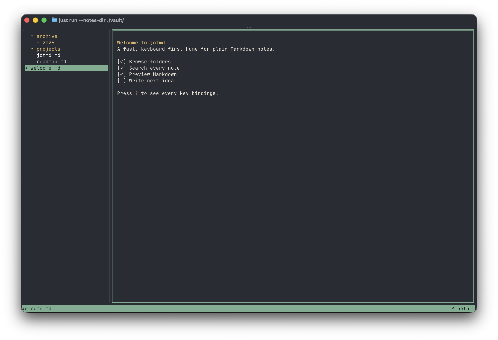

# jotmd

Keyboard-first Markdown notes for the terminal. Browse plain files, search your
vault, and preview Markdown without leaving the command line.



## Install

On macOS with [Homebrew](https://brew.sh/):

```sh
brew install gonfff/tap/jotmd
```

Or build from source with Go 1.26+ and [just](https://just.systems/):

```sh
git clone https://github.com/gonfff/jotmd.git
cd jotmd
just install # installs to ~/.local/bin/jotmd
```

## Quick start

Run `jotmd`. On first launch it asks where your notes live, creates the
directory if needed, and writes configuration under `~/.config/jotmd/` (or
`$XDG_CONFIG_HOME/jotmd/`). You can also skip the prompt:

```sh
mkdir -p ~/notes
jotmd --notes-dir ~/notes
```

JotMD uses `--editor` or the configured editor, then `$EDITOR`, then `vi`.

## What it does

- Browses directories and `.md` files with a live, wrapping Markdown preview.
- Searches note names and contents; includes a table of contents and raw view.
- Creates, renames, copies, moves, trashes, and permanently deletes notes.
- Reloads notes, configuration, and key bindings while running.
- Ships with 13 themes and supports custom TOML themes and color overrides.

## Essential keys

| Key | Action |
| --- | --- |
| `j` / `k`, arrows | Navigate |
| `Enter` / `Space` | Expand or open |
| `Tab` | Switch tree and preview |
| `e` | Edit the selected note |
| `n` / `N` | Create a note / directory |
| `/` | Search |
| `t` | Select a theme |
| `:` | Open the command palette |
| `?` | Show all key bindings |
| `q` | Quit |

Key bindings are configurable in `~/.config/jotmd/keybindings.toml`. Run
`jotmd --dump-keys` to print the effective bindings.

## Configuration

CLI flags override environment variables, which override `config.toml` and
defaults. Configuration files are created automatically on first launch and
document every setting.

Optional configuration commands:

- `jotmd --init-themes` exports bundled themes as editable TOML files without
  overwriting existing customizations.
- `jotmd --list-themes` lists names accepted by `--theme` and `theme` in
  `config.toml`.
- `jotmd --dump-config` prints the effective configuration after defaults,
  files, environment variables, and CLI flags are merged.
- `jotmd config check [PATH]` validates the configuration, key bindings,
  editor, and theme without starting the TUI.

Useful overrides include `--notes-dir`, `--theme`, and `--editor`; run
`jotmd --help` for the complete CLI.

## Development

```sh
just run       # run from the checkout
just build     # build bin/jotmd
just test      # run tests
just check     # format check, vet, and tests
```

## License

[MIT](LICENSE)
